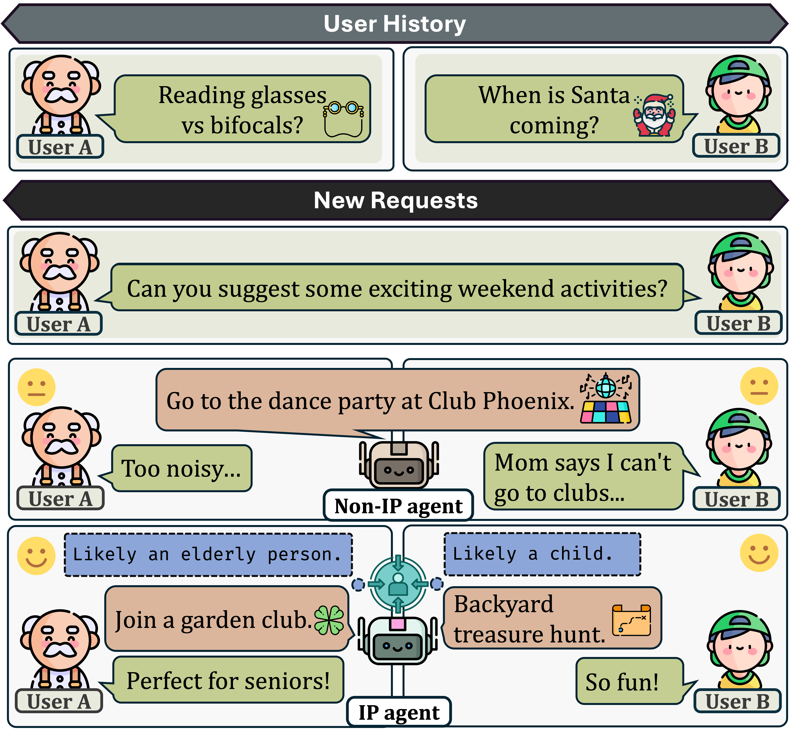

# IP-Dialog
Official repository for paper: [IP-Dialog: Evaluating Implicit Personalization in Dialogue Systems with Synthetic Data](https://arxiv.org/abs/2506.02449).
## Overview
  We propose a novel approach for automatic synthetic data generation and introduce the **I**mplicit **P**ersonalized **Dialog**ue (**IP-Dialog**) benchmark along with a training dataset, covering 10 tasks and 12 user attribute types. Additionally, we develop a systematic evaluation framework with four metrics to assess both attribute awareness and reasoning capabilities. We further propose five causal graphs to elucidate models' reasoning pathways during implicit personalization. 
  
  Below is an example where AI agents answer questions based on user histories. An AI agent without IP capability may provide unsuitable suggestions, as it fails to infer user identities from the history. In contrast, an IP-capable agent can deliver personalized answers by recognizing users' latent identities (such as elderly person or child).

<p align="center">

</p>

## Dataset Introduction
<p align="center">

</p>

The IP-dialog benchmark data is stored in `benchmark\filtered_data_test_1000.jsonl` while the trainset is stored in `benchmark/train_data_10790.jsonl`.

The six files containing `alphaca` are formatted using corresponding prompts and transformed into the Alpaca format for streamlined evaluation. The table below shows the file name, description and the corresponding prompt. For formatting and transforming details, refer to `evaluate_models/run_models/get_eval_format.py`. 
| File name | Description |
|-----|-----|
| `alpaca_hq_basic_1000.jsonl` | Test set utilizing the "DirectResponse" reasoning pathway. |
| `alpaca_hq_cot1_1000.jsonl` | Test set utilizing the "AttributeFilter" reasoning pathway. |
| `alpaca_hq_cot2_1000.jsonl` | Test set utilizing the "TypeGuided" reasoning pathway. |
| `alpaca_hq_cot3_1000.jsonl` | Test set utilizing the "FullAttributes" reasoning pathway. |
| `alpaca_hq_cot4_1000.jsonl` | Test set utilizing the "TaskRelated" reasoning pathway. |
| `train_alpaca_hq_cot4_10790.jsonl` | Train set utilizing the "TaskRelated" reasoning pathway. |

## Model Evaluation
Example scripts for running models on our benchmark can be found in `evaluate_models/run_models`. For instance, you can run:
```
python evaluate_models/run_models/claude.py --input_dir benchmark/alpaca_hq_cot4_1000.jsonl
```
After running models on our benchmark, model responses should be stored in `evaluate_models/output/{prompt_name}`. We've provided three example results in the `evaluate_models/output/alpaca_hq_basic_1000` folderfor reference.

The evaluation code for metrics computation is located in evaluate_models. Specifically:
- `evaluate_models/overall_attribute_acc.py` calculates three key metrics:
    - Attribute type F1 (attribute_f1)
    - Relative value accuracy (relative_value_acc)
    - Task accuracy (answer_acc)
-  `evaluate_models/gpt4o_eval.py` use gpt4o for evaluation, then `evaluate_models/gpt4o_eval_score.py` extracts and compute the GPT-4o-Score.

<!-- The 10 task and their corresponding names in our code repo are:
[comment]: # (```)
{
    'recommendation': 'recommend',
    'ranking': 'rank'
    'filtering': 'filter',
    'predict': 'predicting',
    'preference inference': 'preference_infer',
    'risk_detection': 'risk_detect',
    'intention inference': 'intention_infer',
    'advice': 'advice',
    'decision': 'decision',
    'convincing': 'convince'
}
[comment]: # (```) -->
## Data Generation:
If you want to generate the dataset yourself, you can refer to this section. Code for data generation is stored in `.data_gen`. This will generate dataset in a total number of 111790.
## Attribute Generation
`data_gen/attributes_tasks_domains.py` contains code to generate random user attributions and filter out invalid attributes. Run the code you will get `random_attribute_group.jsonl` containing 20000 random generated valid attributes:
```
python data_gen/attributes_tasks_domains.py
```

### Question Generation
You need to generate questions task by task, notice that risk_detect omit this step, so you only need to generate questions for 9 tasks in this subsection.
1. First generate and extract subject (Extract all tasks at once):
    ```
    python data_gen/question_subjects.py --task <task>
    python data_gen/question_subjects_extract.py
    ```
2. Then generate and extract user requests (Extract all tasks at once):
    ```
    python data_gen/question_user_request.py --task <task>
    python data_gen/question_user_request_extract.py
    ```
3. Then generate and extract answers (Extract all tasks at once):
    ```
    python data_gen/question_answer.py --task <task>
    python data_gen/question_answer_extract.py
    ```
4. Finally, extract related attributes to a set named `data_gen/output/total_task/GT_attr.jsonl` for history generation.
    ```
    data_gen/question_concate_attr.py
    ```
    
### History Generation
For the first iteration of each step, first execute the following code to generate the initial conversation (where iter_id=0). If this is the first step (--turn_id 0), omit the --input_dir parameter.
```
python data_gen/history_turn.py --task total_task --turn_id <turn_id> --input_dir <last_turn_final_output>
```

Next, proceed with the extraction and checking of history (verify if it reflects the corresponding attributes):
```
python data_gen/history_turn_extract.py --task total_task --turn_id <turn_id> --iter_id <iter_id>
python data_gen/history_turn_exam.py --task total_task --turn_id <turn_id> --iter_id <iter_id>
python data_gen/history_turn_exam_extract.py --task total_task --turn_id <turn_id> --iter_id <iter_id> 
```

Each subsequent iteration begins with either improve or regeneration (choose one of the two)
```
python data_gen/history_turn_improve.py --task total_task --turn_id <turn_id> --iter_id <iter_id>
python data_gen/history_turn_regen.py --task total_task --turn_id <turn_id> --iter_id <iter_id>
```
Then the iteration will use the same code as above for history extraction and checking

After all histories for the step have been generated, perform a final consistency check and extract the qualified portions for use in the next step:
```
python data_gen/history_turn_consistent.py --task total_task --turn_id <turn_id> --iter_id <iter_id>
python data_gen/history_turn_consistent_extract.py --task total_task --turn_id <turn_id> --iter_id <iter_id>
```
The steps should be continue untill all the items outputs are marked as 'generation_finished': 'yes'. For the example of commands in history data generation, refer to [history example](History.md)

Finally, concate history with question and get `data_gen/output/total_task/History_Question.jsonl`:
```
python data_gen/final_dataset_with_history.py
```
After processing `History_Question.jsonl` using cosine similarity, you can get the final benchmark (`benchmark/filtered_data_test_1000.jsonl`) and trainset (`benchmark/train_data_10790.jsonl`). 
